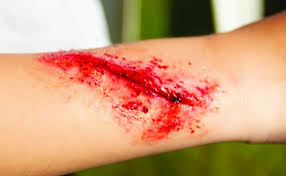

Here's a `README.md` for your wound detection project based on the instructions you provided:

---

# 🔍 Wound Detection Using OpenCV

## 📝 Overview

This project demonstrates a basic computer vision application that detects **red-colored wounds** in medical images using **color segmentation** and **contour detection**. The goal is to automatically identify wound regions based on their red color in an image, highlight them with bounding boxes, and label them for visualization.

## 🛠️ Technologies Used

* **Python**
* **OpenCV**
* **NumPy**

## ⚙️ How It Works

1. The image is loaded and converted from BGR to HSV color space.
2. Red color ranges are defined in HSV to isolate wound-like regions.
3. Morphological operations (opening and closing) are applied to clean up the binary mask.
4. Contours are found in the binary mask to detect wound-like shapes.
5. Bounding rectangles and labels are drawn around detected wound areas.

## 💡 Usage

1. Place your wound image (e.g., `wound.jpg`) in the project directory.
2. Make sure all required libraries are installed:

   ```bash
   pip install opencv-python numpy
   ```
3. Run the main file:

   ```bash
   python main.py
   ```
4. A window will open showing the image with detected wound regions marked.

## ✅ Output

The output is a visual representation of the original image with green rectangles around areas identified as wounds. These areas are labeled with the text **"Wound"**. The detection works for red-colored regions based on HSV color filtering.




